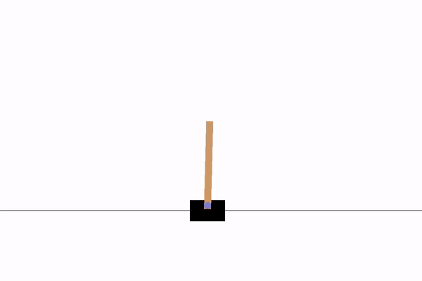
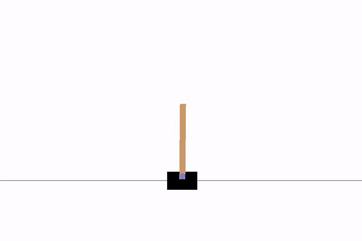
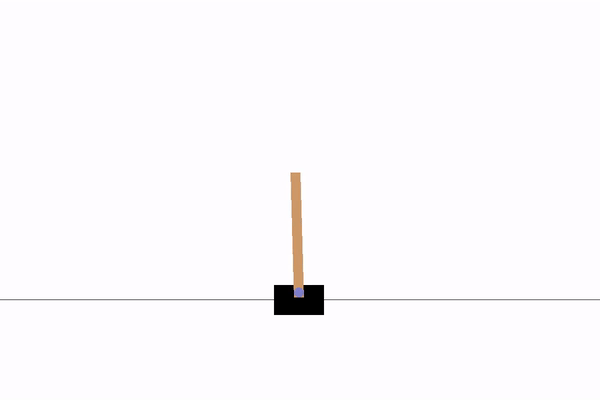
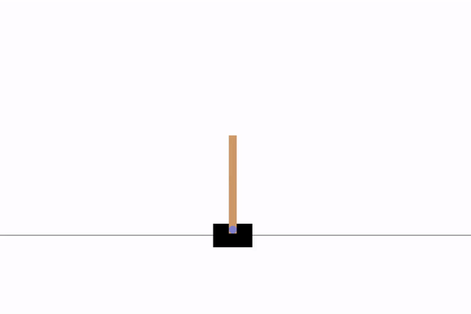
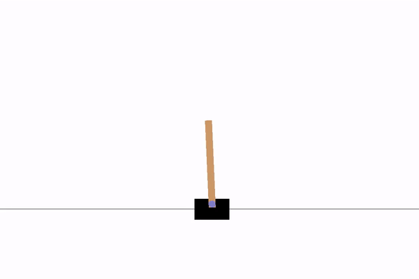
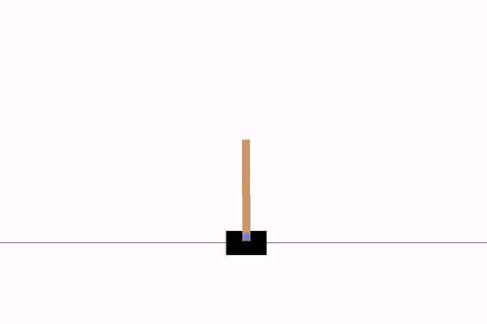

# Reinforcement Learning Agents 
Implemented for Tensorflow 2.0+

## New Updates!
- DDPG with prioritized replay
- Primal-Dual DDPG for CMDP

## Future Plans
- SAC Discrete

## Usage
- Install dependancies imported ([my tf2 conda env as reference](https://github.com/anita-hu/TF2-RL/blob/master/mytf2env.txt))
- Each file contains example code that runs training on CartPole env
- Training: `python3 TF2_DDPG_LSTM.py`
- Tensorboard: `tensorboard --logdir=DDPG/logs`

## Hyperparameter tuning
- Install hyperopt https://github.com/hyperopt/hyperopt
- Optional: switch agent used and configure param space in `hyperparam_tune.py` 
- Run: `python3 hyperparam_tune.py`

## Agents
Agents tested using CartPole env.

| Name | On/off policy | Model | Action space support |
| --- | --- | --- | --- | 
| [DQN](https://www.cs.toronto.edu/~vmnih/docs/dqn.pdf) | off-policy | Dense, LSTM | discrete |
| [DDPG](https://arxiv.org/pdf/1509.02971.pdf) | off-policy | Dense, LSTM | discrete, continuous | 
| [AE-DDPG](https://arxiv.org/pdf/1903.00827.pdf) | off-policy | Dense | discrete, continuous | 
| [SAC:bug:](https://arxiv.org/pdf/1812.05905.pdf) | off-policy | Dense | continuous |
| [PPO](https://arxiv.org/pdf/1707.06347.pdf) | on-policy | Dense | discrete, continuous | 

#### Contrained MDP
| Name | On/off policy | Model | Action space support |
| --- | --- | --- | --- | 
| [Primal-Dual DDPG](https://arxiv.org/pdf/1802.06480.pdf) | off-policy | Dense | discrete, continuous|

## Models
Models used to generate the demos are included in the repo, you can also find q value, reward and/or loss graphs 

## Demos
| DQN Basic, time step = 4, 500 reward | DQN LSTM, time step = 4, 500 reward |
| --- | --- |
|  |  |

| DDPG Basic, 500 reward | DDPG LSTM, time step = 5, 500 reward |
| --- | --- |
|  |  |

| AE-DDPG Basic, 500 reward | PPO Basic, 500 reward |
| --- | -- |
|  |  |
