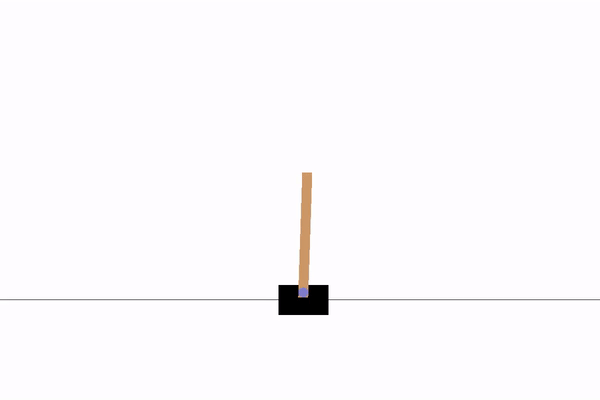

# Reinforcement Learning Agents 
Implemented for Tensorflow 2.0+ (use version 2.1 to avoid memory leak issues)
## Usage
- Install dependancies imported in python file (including tensorflow 2.0+, gym, numpy, matplotlib)
- Each file contains example code that runs training on CartPole env
- Example: `python3 TF2_DQN_LSTM.py`
## Agents
All agents tested using CartPole env with modified reward
- DQN (basic and with LSTM model)
- DDPG (basic and with LSTM model; supports discrete and continuous action space)
## Models
Models used to generate the demos are included in the repo, you can also find q value and reward graphs that were generated after training
## Demos
| DQN Basic, time step = 4, 500 reward | DQN LSTM, time step = 4, 500 reward |
| --- | --- |
|  |  |

| DDPG Basic, 222 reward | DDPG LSTM, time step = 5, 500 reward |
| --- | --- |
|  |  |
